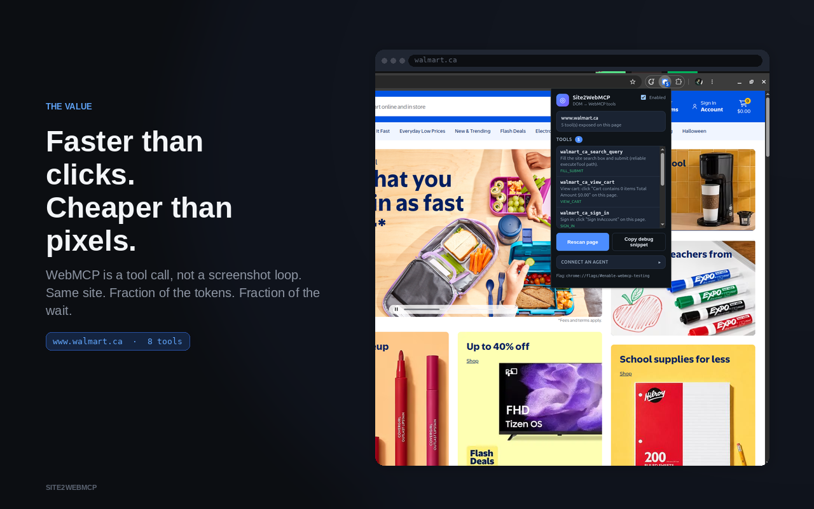

# Site2WebMCP



Demo: https://www.youtube.com/watch?v=JejjEiZ4h3c

**Chrome extension + agent skill that turns the current page’s forms and primary actions into [WebMCP](https://developer.chrome.com/docs/ai/webmcp/imperative-api) tools** so AI agents can use real sites without a hand-written MCP server or pixel clicking.

MIT licensed. Works on any `http(s)` page where WebMCP is available (Chrome flag / capable agent browser).

## Install page (agents)

**GitHub Pages:** https://tradunsky.github.io/site2webmcp/

Open that URL in a WebMCP-capable browser. The page registers:

- `install_site2webmcp` — returns the skill markdown + install instructions
- `get_inject_snippet` — URLs / JS to inject on third-party pages
- `get_extension_install` — short Chrome extension setup

If `modelContext` is missing, enable `chrome://flags/#enable-webmcp-testing`, relaunch, and reload. Skill text is still shown for copy-paste.

### Agent inject (Codex CLI + agent-browser)

With **agent-browser**, on any page after each load, inject **in order**:

1. `https://tradunsky.github.io/site2webmcp/vendor/discover.js`
2. `https://tradunsky.github.io/site2webmcp/vendor/page-bridge.js`
3. `https://tradunsky.github.io/site2webmcp/agent-inject.js`

Then list tools via `document.modelContext` / `navigator.modelContext` and prefer them over UI clicking.

Skill sources:

- Pages: https://tradunsky.github.io/site2webmcp/site2webmcp/SKILL.md
- Repo (Codex / Cursor style): [`pages/site2webmcp/SKILL.md`](pages/site2webmcp/SKILL.md) ([Agent Skills](https://agentskills.io/specification) layout)

## What it does

1. **Declarative (forms)** — annotates discoverable `<form>` elements with `toolname` / `tooldescription` / `toolautosubmit` when safe.
2. **Imperative (actions)** — registers tools via `document.modelContext.registerTool` for CTAs, search fill+submit, `click_link`, `find_in_page`, and related page-derived actions.

Tools are discovered from the live DOM (then deduped). Same-action controls with different entities become one tool with a parameter enum when possible.

## Install Chrome extension (developers)

Path unchanged: load the **`extension/`** folder.

1. Enable `chrome://flags/#enable-webmcp-testing` → relaunch Chrome.
2. `chrome://extensions` → Developer mode → **Load unpacked** → select the `extension/` folder.
3. Open any website → click the extension popup to see discovered tools.

Or install from the Chrome Web Store once published.

## Demo modes

1. **Codex CLI + Skill + agent-browser** — install `site2webmcp`, drive **agent-browser**, inject scripts on each page load. (ChatGPT desktop’s built-in browser is read-only and will not work.)
2. **Chrome extension + agent-browser** — load `extension/`; same path as the [demo video](https://www.youtube.com/watch?v=JejjEiZ4h3c).

## Connect an agent

See **[docs/CONNECT_AGENT.md](docs/CONNECT_AGENT.md)**. The extension popup has a short version under **Connect an agent**.

| Client | Path |
|--------|------|
| **Codex CLI + agent-browser + skill** | Inject the three Pages scripts (demo mode 1) |
| **Codex CLI + agent-browser + extension** | Load `extension/` (demo mode 2 / video) |
| **ChatGPT desktop built-in browser** | **Not supported** (read-only pages) |
| **Chrome + WebMCP flag** | Extension for humans; DevTools `getTools()` |

## Verify in DevTools

```js
const ctx = document.modelContext ?? navigator.modelContext;
if (!ctx) {
  console.warn("WebMCP unavailable — check the flag + secure context (https or localhost)");
} else {
  const tools = await ctx.getTools();
  console.table(tools.map((t) => ({ name: t.name, description: t.description })));
}
```

## Repo layout

```
extension/                 # Chrome MV3 package (store zip root)
pages/                     # GitHub Pages install site (deploy root)
  index.html
  install-app.js           # WebMCP tools on the install page
  agent-inject.js          # scan + site2webmcp:register for third-party pages
  site2webmcp/SKILL.md
  vendor/                  # synced copies of discover.js + page-bridge.js
pages/site2webmcp/       # Agent Skills package (Codex CLI + agent-browser)
scripts/sync-pages-vendor.sh
.github/workflows/pages.yml
docs/
LICENSE
```

After changing `extension/discover.js` or `extension/page-bridge.js`, run:

```bash
./scripts/sync-pages-vendor.sh
```

## Packaging for Chrome Web Store

Zip the **contents** of `extension/` so `manifest.json` is at the zip root.

## Troubleshooting

- **`modelContext` undefined:** enable the WebMCP testing flag; use `https://` or `http://localhost` (not `0.0.0.0`).
- **No tools:** reload the page after loading/updating the extension (or re-inject the three scripts).
- **Duplicate search tools:** discovery dedupes `search` vs `search_query` after scan.

## Privacy

The extension processes the current tab locally and does not upload page content. See [PRIVACY.md](PRIVACY.md).
